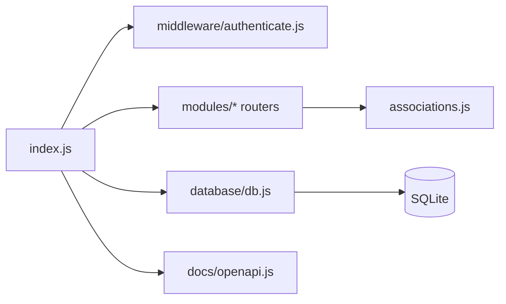

# Pasta src

Contem o entrypoint da API, registrando middlewares, rotas, documentacao Swagger (dev) e conexao com SQLite.

## Visao rapida
- `index.js` inicializa o Express, conecta no banco, registra as rotas e monta Swagger em `/docs` quando `NODE_ENV=development`.
- `database/` guarda a configuracao do Sequelize e o arquivo SQLite.
- `middleware/` contem autenticacao e autorizacao JWT.
- `modules/` concentra modelos, services, controllers e rotas por dominio.
- `docs/` guarda a especificacao OpenAPI utilizada pelo Swagger UI.

