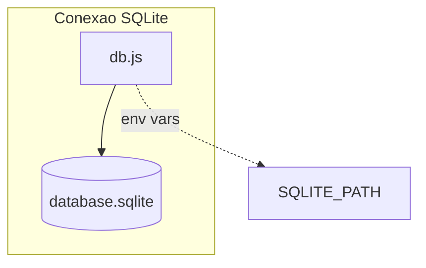

# Pasta src/database

Configura o Sequelize e define o caminho do arquivo SQLite utilizado pela API.

## Arquivos
- `db.js`: cria instancia do Sequelize (dialeto sqlite) e garante o caminho do arquivo definido em `SQLITE_PATH`.
- `database.sqlite`: banco local gerado pelo Sequelize.

