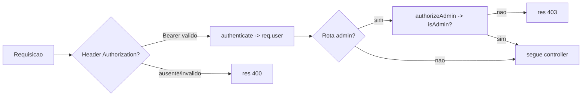

# Pasta src/middleware

Middleware de autenticacao/autorizacao JWT aplicado nas rotas privadas e administrativas.

## Arquivos
- `authenticate.js`: valida token Bearer, popula `req.user` e aplica `authorizeAdmin` para rotas de admin.

