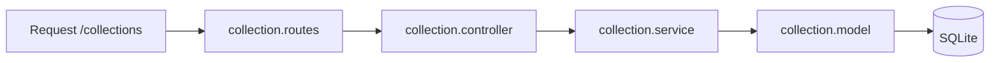

# Pasta src/modules/Collection

CRUD de colecoes pertencentes a usuarios (ownerId). Inclui modelo, service, controller e rotas.

## Arquivos
- `collection.model.js`: define tabela Collections.
- `collection.service.js`: operacoes de persistencia.
- `collection.controller.js`: validacao e respostas HTTP.
- `collection.routes.js`: rotas /collections.

