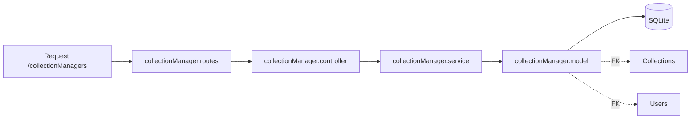

# Pasta src/modules/CollectionManager

Controle de compartilhamento de colecoes entre usuarios.

## Arquivos
- `collectionManager.model.js`: define tabela CollectionManagers.
- `collectionManager.service.js`: operacoes de persistencia.
- `collectionManager.controller.js`: validacao e respostas HTTP.
- `collectionManager.routes.js`: rotas /collectionManagers.

