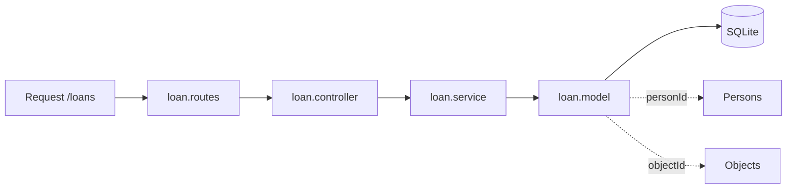

# Pasta src/modules/Loan

CRUD de emprestimos, conectando pessoas e objetos.

## Arquivos
- `loan.model.js`: define tabela Loans.
- `loan.service.js`: operacoes de persistencia.
- `loan.controller.js`: validacao e respostas HTTP.
- `loan.routes.js`: rotas /loans.

