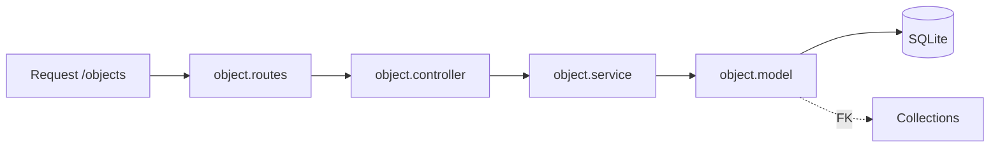

# Pasta src/modules/Object

CRUD de objetos vinculados a uma colecao (collectionId).

## Arquivos
- `object.model.js`: define tabela Objects.
- `object.service.js`: operacoes de persistencia.
- `object.controller.js`: validacao e respostas HTTP.
- `object.routes.js`: rotas /objects.

