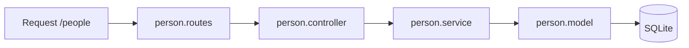

# Pasta src/modules/Person

CRUD de pessoas associadas a emprestimos.

## Arquivos
- `person.model.js`: define tabela Persons.
- `person.service.js`: operacoes de persistencia.
- `person.controller.js`: validacao e respostas HTTP.
- `person.routes.js`: rotas /people.

