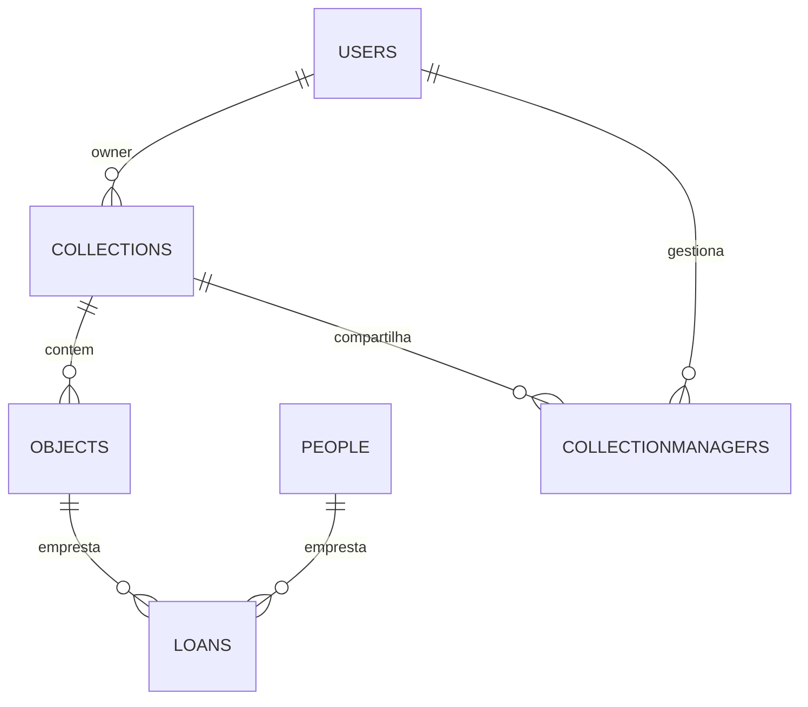

# Pasta src/modules

Concentra dominios da API com modelo, service, controller e rotas. As associacoes sao registradas em `associations.js`.

## Estrutura
- `user/` autenticacao e perfis.
- `Collection/` colecoes de itens.
- `Object/` itens dentro de colecoes.
- `Person/` pessoas ligadas a emprestimos.
- `Loan/` emprestimos de objetos.
- `CollectionManager/` compartilhamento de colecoes.
- `associations.js` registra os relacionamentos.

