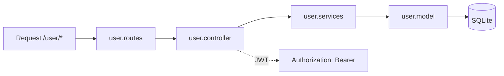

# Pasta src/modules/user

Autenticacao de usuarios, cadastro e gestao de perfis/admin.

## Arquivos
- `user.model.js`: define tabela Users com flags `isAdmin` e `isActive`.
- `user.services.js`: persistencia e hash de senha com bcrypt.
- `user.controller.js`: fluxo de cadastro/login e atualizacao.
- `user.routes.js`: rotas /user (publicas e privadas/admin).

